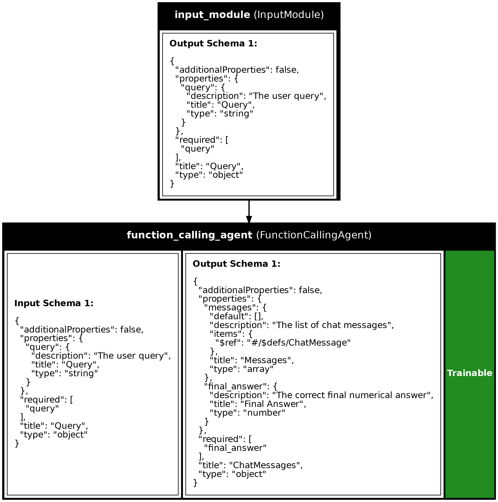

<div align="center">
<picture>
  <source media="(prefers-color-scheme: dark)" srcset="img/synalinks-dark.svg">
  
</picture>
</div>

<div align="center">

<b>From idea to production in just few lines</b>

<em>The first neuro-symbolic Language Model (LM) framework leveraging the simplicity of Keras and the rigor of Deep Learning best practices.</em>

<b>Build [RAGs](https://synalinks.github.io/synalinks/guides/Knowledge%20Base/), [tool-using agents](https://synalinks.github.io/synalinks/guides/Agents/), multi-agents systems, [recursive agents](https://synalinks.github.io/synalinks/guides/Recursive%20Language%20Model%20Agent/) and more in just few lines</b>

[Deutsch](https://zdoc.app/de/SynaLinks/synalinks) | 
[English](https://zdoc.app/en/SynaLinks/synalinks) | 
[Español](https://zdoc.app/es/SynaLinks/synalinks) | 
[Français](https://zdoc.app/fr/SynaLinks/synalinks) | 
[日本語](https://zdoc.app/ja/SynaLinks/synalinks) | 
[한국어](https://zdoc.app/ko/SynaLinks/synalinks) | 
[Português](https://zdoc.app/pt/SynaLinks/synalinks) | 
[Русский](https://zdoc.app/ru/SynaLinks/synalinks) | 
[中文](https://zdoc.app/zh/SynaLinks/synalinks)

<p align="center">
  <a href="https://synalinks.github.io/synalinks" target="_blank"><strong>Documentation</strong></a> ·
  <a href="https://synalinks.github.io/synalinks/FAQ/" target="_blank"><strong>FAQ</strong></a> ·
  <a href="https://discord.gg/82nt97uXcM" target="_blank"><strong>Discord</strong></a> ·
  <a href="https://github.com/SynaLinks/synalinks/tree/main/examples" target="_blank"><strong>Code Examples</strong></a> .
  <a href="https://github.com/SynaLinks/synalinks/tree/main/guides" target="_blank"><strong>Guides</strong></a>
</p>

</div>

<div align="center">

If you find Synalinks useful, please star the repo! Help us reach more AI/ML engineers and grow the community.


[](https://github.com/psf/black)

[](https://pepy.tech/project/synalinks)
[](https://discord.gg/82nt97uXcM)
[](https://github.com/SynaLinks/SynaLinks/actions/workflows/tests.yml)
[](https://opensource.org/license/apache-2-0)
[](https://deepwiki.com/SynaLinks/synalinks)

</div>

<div align="center">

Want to use Synalinks with your own coding agent (Claude Code, Cursor, Copilot, etc.)? Add the Synalinks-specific skills from [`synalinks-skills`](https://github.com/SynaLinks/synalinks-skills) on GitHub to your agent — they teach it the framework conventions and give it the context it needs to build Synalinks programs right away.

</div>

## What Is Synalinks?

Synalinks is an open-source neuro-symbolic framework that makes it simple to create, train, evaluate, and deploy advanced LM-based applications, including RAGs, autonomous agents, and self-evolving reasoning systems.

Think Keras for Language Models applications, a clean, declarative API where:

- You **compose** [`Module`s](https://synalinks.github.io/synalinks/guides/Modules/) like you would with deep learning `Layer`s.
- You **[train & optimize](https://synalinks.github.io/synalinks/guides/Training/)** with in-context reinforcement learning.
- You **deploy** as [REST APIs](https://synalinks.github.io/synalinks/guides/FastAPI%20Deployment/) or [MCP servers](https://synalinks.github.io/synalinks/guides/FastMCP%20Deployment/).

### Key Principles

- **Progressive complexity**: [Start simple and grow advanced naturally](https://synalinks.github.io/synalinks/guides/Getting%20Started/).
- **Neuro-symbolic learning**: Combine [logic, structure](https://synalinks.github.io/synalinks/guides/Data%20Models/), and [language models](https://synalinks.github.io/synalinks/guides/Getting%20Started/).
- **In-context optimization**: [Improve model reasoning without retraining weights](https://synalinks.github.io/synalinks/guides/Trainable%20Variables/).

## Who Is It For?

<div align="center">

| Role                      | Why Synalinks Helps                                         |
| ------------------------- | ----------------------------------------------------------- |
| **AI Developers**      | Build complex production grade LM apps without boilerplate. |
| **AI Researchers**     | Prototype neuro-symbolic and RL-in-context systems fast.    |
| **Data Scientists**    | Integrate LM workflows with APIs & databases.               |
| **Students/Hobbyists** | Learn AI composition in a clean, intuitive framework.       |

</div>

## Why Synalinks?

Many frameworks exist today — here is what Synalinks does differently:

- **Embedded, container-free sandbox** : agents run untrusted code and tools in a [safe, isolated runtime](https://synalinks.github.io/synalinks/guides/Agents/) that needs **no Docker or external sandbox service**. The whole stack is pure-Python and embeddable, so it is great for scripting, research, serverless/cloud deployment (S3, Lambda, notebooks, etc.) or even for creating CLI harnesses!
- **Embedded database support** : build [graph-based RAG and agentic memories](https://synalinks.github.io/synalinks/guides/Knowledge%20Base/) with **constrained Knowledge Graph extraction** and **automatic semantic deduplication**, on top of an embedded graph database — no separate graph server to run. Additionally, a fast embedded **SQL knowledge base** is available to store relational data and build vector/SQL RAGs.
- **In-Context RL to optimize your prompts (and anything else)** : [train and optimize](https://synalinks.github.io/synalinks/guides/Training/) prompts, few-shot examples, and [any trainable variable](https://synalinks.github.io/synalinks/guides/Trainable%20Variables/) per module **without touching model weights**, using the familiar `.compile()` / `.fit()` / `.evaluate()` / `.predict()` API.
- **Effortless model switching** : set a default once with `synalinks.set_default_language_model(...)` or pass a string identifier, and swap between Ollama, vLLM, OpenAI, Azure, Anthropic, Mistral, Groq, Gemini, xAI, Cohere, DeepSeek, Together AI, OpenRouter, AWS Bedrock and Doubleword via [LiteLLM](https://docs.litellm.ai/docs/) — including [multi-objective model selection](https://synalinks.github.io/synalinks/guides/Multi-Objective%20LM%20Selection/) to pick the best model for cost/quality.
- **Scaffold in one command, bring your own coding agent** : bootstrap a production-ready project with `synalinks init` (batteries-included templates for scripts, agents, and training), then drop in the official [Synalinks skills](https://github.com/SynaLinks/synalinks-skills) so Claude Code, Cursor, Copilot and friends write idiomatic Synalinks code from the start.

Plus everything you'd expect from a production-grade framework:

- **[Constrained structured outputs](https://synalinks.github.io/synalinks/guides/Data%20Models/)** (JSON) for correctness
- **Versionable**, JSON-serializable [pipelines](https://synalinks.github.io/synalinks/guides/Programs/)
- **Automatic [async & parallel execution](https://synalinks.github.io/synalinks/guides/Programs/)** by default
- **[Metrics](https://synalinks.github.io/synalinks/guides/Metrics/), [rewards](https://synalinks.github.io/synalinks/guides/Rewards/) & [datasets](https://synalinks.github.io/synalinks/guides/Datasets/)** built-in
- **API-ready**: Deploy with [FastAPI](https://synalinks.github.io/synalinks/guides/FastAPI%20Deployment/) or [FastMCP](https://synalinks.github.io/synalinks/guides/FastMCP%20Deployment/)
- **[KerasTuner compatibility](https://synalinks.github.io/synalinks/guides/Hyperparameter%20Search/)** for hyperparameter search
- **Built-in [callbacks](https://synalinks.github.io/synalinks/guides/Callbacks/) and hooks** for [observability](https://synalinks.github.io/synalinks/guides/Observability/) (including an MLflow `Monitor` callback)

# Requirements

- Python 3.12 or more
- WL2 for windows users

## Quickstart in 3s with `uv` (recommended)

If you don't know `uv`, install it [here](https://docs.astral.sh/uv/getting-started/installation/).

Follow the instructions to start a new synalinks project in 3s:

```shell
uvx synalinks init
```

---

You can also install the library in a new project with:

```shell
uv add synalinks
```

## Example

```python
import synalinks
import asyncio

class Query(synalinks.DataModel):
    query: str = synalinks.Field(
        description="The user query",
    )

class NumericalAnswer(synalinks.DataModel):
    answer: float = synalinks.Field(
        description="The correct final numerical answer",
    )

# Set the defaults once — modules and string-form optimizers/rewards
# pick them up automatically.
synalinks.set_default_language_model("gemini/gemini-3.1-flash-lite-preview")
synalinks.set_default_embedding_model("gemini/text-embedding-004")

@synalinks.saving.register_synalinks_serializable()
async def calculate(expression: str):
    """Calculate the result of a mathematical expression.

    Args:
        expression (str): The mathematical expression to calculate, such as
            '2 + 2'. The expression can contain numbers, operators (+, -, *, /),
            parentheses, and spaces.
    """
    if not all(char in "0123456789+-*/(). " for char in expression):
        return {
            "result": None,
            "log": "Error: invalid characters in expression",
        }
    try:
        # Evaluate the mathematical expression safely
        result = round(float(eval(expression, {"__builtins__": None}, {})), 2)
        return {
            "result": result,
            "log": "Successfully executed",
        }
    except Exception as e:
        return {
            "result": None,
            "log": f"Error: {e}",
        }

async def main():
    inputs = synalinks.Input(data_model=Query)

    outputs = await synalinks.FunctionCallingAgent(
        data_model=NumericalAnswer,
        tools=[
            synalinks.Tool(calculate),
        ],
    )(inputs)

    program = synalinks.Program(
        inputs=inputs,
        outputs=outputs,
        name="math_agent",
        description="A math agent",
    )

```

## Data Model Operators

Synalinks provides Python operators for combining and manipulating data models, enabling sophisticated control flow. See the [Control Flow guide](https://synalinks.github.io/synalinks/guides/Control%20Flow/) for the routing, fan-out, and merge patterns these operators enable:

<div align="center">

| Operator | Name | Description | Use Case |
| :---: | --- | --- | --- |
| `+` | Concatenation | Combines fields from both data models. Raises exception if either is `None`. | Merging outputs from parallel branches |
| `&` | Logical And | Safe concatenation that returns `None` if either input is `None`. | Combining with potentially null branch outputs |
| `\|` | Logical Or | Returns the non-`None` data model. If both are non-`None`, merges them. | Gathering outputs from conditional branches |
| `^` | Logical Xor | Returns data if exactly one input is non-`None`, otherwise `None`. | Exclusive branch selection |
| `~` | Logical Not | Returns `None` if input is non-`None`, or a empty data model if `None`. | Inverting branch conditions |
| `in` | Contains | Checks if a string key exists in the schema properties, or if another data model's schema is contained. Returns `True` or `False`. | Conditional field checking, schema validation |

</div>

```python
# Parallel branches with concatenation
x1 = await generator1(inputs)
x2 = await generator2(inputs)
combined = x1 & x2  # Merge both outputs

# Conditional branches with logical or
(easy, hard) = await synalinks.Branch(
    question="Is this query complex?",
    labels=["easy", "hard"],
    branches=[simple_generator, complex_generator],
)(inputs)
result = easy | hard  # Get whichever branch was selected
```

## Getting a summary of your program

To print a tabular summary of your program:

```python
program.summary()
```

Or a plot (Useful to document your system):

```python
synalinks.utils.plot_program(
    program,
    show_module_names=True,
    show_trainable=True,
    show_schemas=True,
)
```

<div align="center">


<em>The math agent program visualized with plot_program: Input → FunctionCallingAgent. Trainable modules are marked in green.</em>
</div>

## Running your program

To run your program use the following:

```python
result = await program(
    Query(
        query=(
            "A bookstore receives a shipment of 135 new books."
            "They place the books evenly onto 9 shelves."
            "Later, they decide to move 3 books from each shelf to a display table"
            " at the front of the store. "
            "How many books are left on the shelves after the books are moved?"
        )
    ),
)
```

## Training your program/agent

```python

# Setting the default language/embedding models allows you
# to use the string identifier (Keras-like) to configure your pipeline/training.
# You can still instantiate the classes if you want fine-grained control.
synalinks.set_default_language_model("gemini/gemini-3.1-flash-lite-preview")
synalinks.set_default_embedding_model("gemini/text-embedding-004")

async def main():
    

    # ... your program definition

    (x_train, y_train), (x_test, y_test) = synalinks.datasets.gsm8k.load_data()

    program.compile(
        reward=synalinks.rewards.ExactMatch(in_mask=["answer"]),
        optimizer="omega",
    )

    batch_size=1
    epochs=10

    history = await program.fit(
        x_train,
        y_train,
        validation_split=0.2,
        batch_size=batch_size,
        epochs=epochs,
    )

if __name__ == "__main__":
    asyncio.run(main())
```

## Saving & Loading

To save the entire architecture and variables (the program's state) into a JSON file, do:

```python
program.save("my_program.json")
```

In order to load it, do:

```python
loaded_program = synalinks.Program.load("my_program.json")
```

To save only the state your program (the variables) into JSON:

```python
program.save_variables("my_program.variables.json")
```

To load its variables (needs a program with the same architecture), do:

```python
program.load_variables("my_program.variables.json")
```

## Logging

To enable logging, use the following at the beginning of your script:

```python
synalinks.enable_logging()
```

## Observability

Synalinks provides built-in observability through MLflow for tracing and monitoring your programs.

> **Important**: Call `enable_observability()` **before** creating any modules.

```python
import synalinks

# Enable observability first
synalinks.enable_observability(
    tracking_uri="http://localhost:5000",  # Optional: MLflow server URI
    experiment_name="my_experiment"         # Optional: defaults to "synalinks_traces"
)

# Then create your modules - they will be automatically traced
inputs = synalinks.Input(data_model=Query)
outputs = await synalinks.Generator(...)(inputs)
```

For training metrics and artifacts, use the `Monitor` callback:

```python
monitor = synalinks.callbacks.Monitor(
    tracking_uri="http://localhost:5000",
    experiment_name="training_runs",
)

await program.fit(x=train_x, y=train_y, callbacks=[monitor])
```

See the [Observability guide](https://synalinks.github.io/synalinks/guides/Observability/) for advanced configuration.

### Learn more

You can learn more by reading our [documentation](https://synalinks.github.io/synalinks/). If you have questions, the [FAQ](https://synalinks.github.io/synalinks/FAQ/) might help you.

### Contributions

Contributions are welcome, either for the implementation of additional modules, metrics, or optimizers.
For more information, or help for implementing your ideas (or ones from a paper), please join our discord.

Beware that every additional metric/module/optimizer should be approved by the core team, we want to keep the library minimal and clean as possible to avoid an uncontrolled growth leading to bad software practices like in most current leading LM frameworks.

If you have specific feedbacks or features request we invite you to open an [issue](https://github.com/SynaLinks/synalinks/issues).

### Contributors

Your contributions, feedback, and support are what make this project thrive.

From small bug fixes to major features, thank you for believing in open collaboration and the future of neuro-symbolic AI.

<a href="https://github.com/SynaLinks/synalinks/graphs/contributors">
  
</a>

### Community

Join our community to learn more about neuro-symbolic systems and the future of AI. We welcome the participation of people from very different backgrounds or education levels.

### Citing our work

This work have been done under the supervision of François Chollet, the author of Keras. If this work is useful for your research please use the following bibtex entry:

```bibtex
@misc{sallami2025synalinks,
  title={Synalinks},
  author={Sallami, Yoan and Chollet, Fran\c{c}ois},
  year={2025},
  howpublished={\url{https://github.com/SynaLinks/Synalinks}},
}
```

### Credit

Synalinks would not be possible without the great work of the following open-source projects:

- [Keras](https://keras.io/) for the graph-based computation backbone, API and overall code, design and philosophy.
- [DSPy](https://dspy.ai/) for the modules/optimizers inspiration.
- [Pydantic](https://docs.pydantic.dev/latest/) for the backend data layer & their [Monthy](https://pydantic.dev/articles/pydantic-monty) embedded REPL sandbox.
- [LiteLLM](https://docs.litellm.ai/docs/) for the LMs integrations.
- [DuckDB](https://duckdb.org/), [Ladybug](https://ladybugdb.com/), [LanceDB](https://www.lancedb.com/) for their amazing embedded databases.
