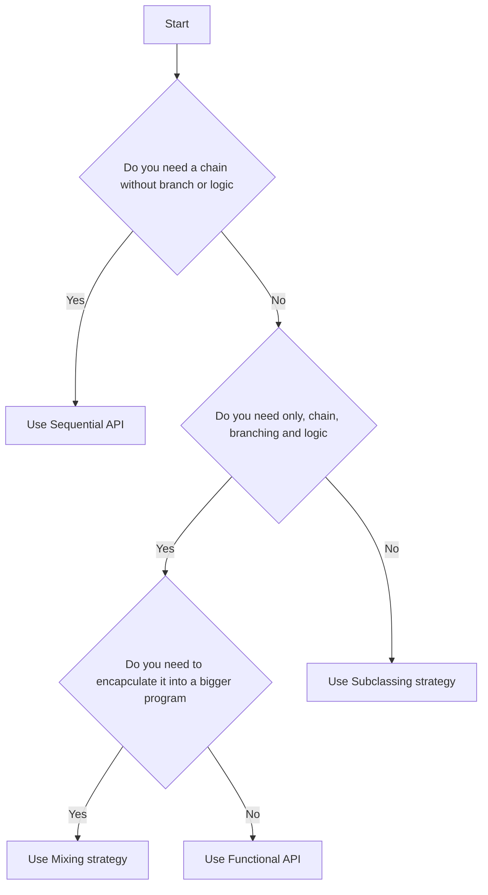

# CheatSheet

This document provides a quick recap on how to use Synalinks efficiently.

- If you come from a **Deep Learning / ML** background, Synalinks will feel natural and structured.
- If you come from a **Python Backend** background, expect a short learning curve to learn ML concepts.
- If you have experience with **Pydantic and LM workflows**, you can likely use it immediately.

---

## What do I need to know to use Synalinks?

To work effectively with Synalinks, you should already know:

| Skill                          | Required Level                  |
| ------------------------------ | ------------------------------- |
| Python                         | **3–5 years**                   |
| Pydantic + Structured Output   | **~1 year**                     |
| Basic Linear Algebra & Metrics | **High-school level is enough** |
| CS Fundamentals (OOP + FP)     | **Comfortable**                 |

## How to choose which programming way to use?

Synalinks supports 4 main ways of building programs:

| Approach                              | Difficulty | When to Use                                                 |
| ------------------------------------- | ---------- | ----------------------------------------------------------- |
| **Functional API**                    | Easy       | Simple chaining, branching, aggregation, basic logic        |
| **Sequential API**                    | Easy       | Simple sequence without branching                           |
| **Mixing (Functional + Subclassing)** | Easy       | Wrap chains into reusable systems                           |
| **Subclassing**                       | Advanced   | Custom loops, evolving state, or complex logic              |



- Prefer Functional API when possible it is versatile, simplest & fastest.
- Use Mixing strategy when packaging functional logic into reusable components.
- Use Subclassing only for: Custom loops, validation logic beyond Pydantic constraints and evolving internal state inside the module.

For more information on how to use each way, refer to the [Program](Synalinks API/Programs API/The Program class.md) section of the documentation.

## How to execute a program?

```python
import synalinks

class UserQuery(synalinks.DataModel):
    query: str

async def main():

    # ... your program definition

    result = await program(UserQuery(query="what is the capital of France?"))

```

## How to batch the program execution?

You can batch the program execution to make inferences in parrallel (use asyncio under the hood) by using the `program.predict()` method. This method take as input a numpy array of data models.

```python
import numpy as np
import synalinks

batch = np.array(
    [
        UserQuery(query="what is the capital of France?"),
        UserQuery(query="what is the capital of Germany?"),
        UserQuery(query="what is the capital of Italy?"),
    ]
    dtype="object",
)

async def main():

    # ... your program definition

    results = await program.predict(batch)

    for result in results:
        print(result.prettify_json())

```

## How to define the reward and optimizer to use during training?

To define the reward and optimizer to use during training, use the `program.compile()` method.

```python
import synalinks


async def main():

    # ... your program definition

    program.compile(
        reward=synalinks.rewards.ExactMath()
        optimizer=synalinks.optimizers.OMEGA(
            language_model=language_model,
            embedding_model=embedding_model,
        )
        metrics=[
            synalinks.metrics.F1Score()
        ]
    )

    history = await program.fit(...)

```

## How to evaluate a program?

To evaluate a program, you can use the `program.evaluate()` method, after compiling your program.

```python
import synalinks

async def main():

    # ... your program definition

    program.compile(...)

    metrics = program.evaluate(x=x_train, y=y_train)


```

## How to train my program?

You can train your program using the `program.fit()` method, after compiling you program.

```python
import synalinks

async def main():

    # ...
    # Your program definition

    program.compile(...)

    history = await program.fit(
        x=x_train,
        y=y_train,
        validation_split=0.2,
        batch_size=1,
        epochs=5,
    )
```

## How to use the concatenation operation?

```python
import synalinks

synalinks.enable_logging()

class Query(synalinks.DataModel):
    query: str


class Answer(synalinks.DataModel):
    answer: str


# Synalinks operators works at a metaclass level
# In that case, the result is a `SymbolicDataModel`
# A `SymbolicDataModel` can be understand as a data
# specification/contract. It only contains a JSON schema
# and cannot be used for computation. It allow Synalinks
# to build directed acyclic graph (DAG) of computation
# from inputs and outputs, like the tensor shape
# in deep learning frameworks.

qa_pair = Query + Answer

assert isinstance(qa_pair, synalinks.SymbolicDataModel)

print(qa_pair.prettify_schema())
# {
#   "additionalProperties": false,
#   "properties": {
#     "query": {
#       "title": "Query",
#       "type": "string"
#     },
#     "answer": {
#       "title": "Answer",
#       "type": "string"
#     }
#   },
#   "required": [
#     "query",
#     "answer"
#   ],
#   "title": "Query",
#   "type": "object"
# }

# Once we concatenate two instanciated data models, the result
# is a JsonDataModel, a data model containing both a JSON schema and
# a JSON object containing the actual data.

qa_pair = Query(query="What is the French city of aeronautics and robotics?") + Answer(
    answer="Toulouse"
)

assert isinstance(qa_pair, synalinks.JsonDataModel)

print(qa_pair.prettify_json())
# {
#   "query": "What is the French city of aeronautics and robotics?",
#   "answer": "Toulouse"
# }
```

What happen if you concatenate two data models with the same fields?
When property names conflict, numerical suffixes are added to ensure uniqueness.

```python

two_queries = Query + Query

print(two_queries.prettify_schema())

# {
#   "additionalProperties": false,
#   "properties": {
#     "query": {
#       "title": "Query",
#       "type": "string"
#     },
#     "query_1": {
#       "title": "Query 1",
#       "type": "string"
#     }
#   },
#   "required": [
#     "query",
#     "query_1"
#   ],
#   "title": "Query",
#   "type": "object"
# }

two_queries = Query(
    query="Why is neuro-symbolic systems powering the next AI wave?"
) + Query(query="Can you give a multiple of 5?")


print(two_queries.prettify_json())
# {
#   "query": "Why is neuro-symbolic systems powering the next AI wave?",
#   "query_1": "Can you give a multiple of 5?"
# }
```

Now, what happen when you concatenate with `None`? An exception is raised!

```python

failing_query = Query(query="Why is neuro-symbolic AI powering the next wave?") + None
# ValueError: Received x1=query='Why is neuro-symbolic AI powering the next wave?' and x2=None
```

This behavior can be summarized with the following truth table:

| `x1`   | `x2`   | Concat (`+`)      |
| ------ | ------ | ----------------- |
| `x1`   | `x2`   | `x1 + x2`         |
| `x1`   | `None` | `Exception`       |
| `None` | `x2`   | `Exception`       |
| `None` | `None` | `Exception`       |

## How to use the logical and operation?

```python
import synalinks

class Query(synalinks.DataModel):
    query: str


class Answer(synalinks.DataModel):
    answer: str


qa_pair = Query & Answer

assert isinstance(qa_pair, synalinks.SymbolicDataModel)

print(qa_pair.prettify_schema())
# {
#   "additionalProperties": false,
#   "properties": {
#     "query": {
#       "title": "Query",
#       "type": "string"
#     },
#     "answer": {
#       "title": "Answer",
#       "type": "string"
#     }
#   },
#   "required": [
#     "query",
#     "answer"
#   ],
#   "title": "Query",
#   "type": "object"
# }

# When performing an And operation with `None` the output is `None`
# You can see the logical And as a robust concatenation operation.

qa_pair = Query(query="Why is neuro-symbolic AI powering the next wave?") & None

assert isinstance(qa_pair, None)
```

Here is the table summarizing the behavior:

| `x1`   | `x2`   | Logical And (`&`) |
| ------ | ------ | ----------------- |
| `x1`   | `x2`   | `x1 + x2`         |
| `x1`   | `None` | `None`            |
| `None` | `x2`   | `None`            |
| `None` | `None` | `None`            |

## How to use the logical or operation?

```python
import synalinks
import asyncio

class Query(synalinks.DataModel):
    query: str


class Answer(synalinks.DataModel):
    answer: str


class AnswerWithThinking(synalinks.DataModel):
    thinking: str
    answer: str
```

When a two data models are provided, the logical or perform a concatenation
of the two data models. However when given a `None`, it ignore it to give
you the one that isn't None.

This behavior can be summarized in the following truth table:

Truth Table:

| `x1`   | `x2`   | Logical Or (`|`) |
| ------ | ------ | ---------------- |
| `x1`   | `x2`   | `x1 + x2`        |
| `x1`   | `None` | `x1`             |
| `None` | `x2`   | `x2`             |
| `None` | `None` | `None`           |

```python

answer = Answer(answer="Toulouse") | None

print(answer.prettify_json())
# {
#   "answer": "Toulouse"
# }

answer = None | AnswerWithThinking(
    thinking=(
        "LAAS CNRS (Laboratoire d'Analyse et d'Architecture des Systèmes) is located in "
        "Toulouse and is renowned for its research in robotics."
        " Toulouse is also widely recognized as a central hub for aeronautics and"
        " space in Europe. It houses the headquarters of Airbus and several "
        "important aerospace research centers"
    ),
    answer="Toulouse",
)

print(answer.prettify_json())
# {
#   "thinking": "LAAS CNRS (Laboratoire d'Analyse et d'Architecture des
# Syst\u00e8mes) is located in Toulouse and is renowned for its research
# in robotics. Toulouse is also widely recognized as a central hub for
# aeronautics and space in Europe. It houses the headquarters of Airbus
# and several important aerospace research centers.",
#   "answer": "Toulouse"
# }
```

Why is that useful ? Let's explain it with an example,
imagine you want an adaptative system that is able to
answer shortly, or take more time to "think" before answering
depending on the question difficulty.

```python
async def main():
    language_model = synalinks.LanguageModel(model="ollama/mistral")

    inputs = synalinks.Input(data_model=Query)
    answer_without_thinking, answer_with_thinking = await synalinks.Branch(
        question="Evaluate the difficulty of the query",
        labels=["easy", "difficult"],
        branches=[
            synalinks.Generator(
                data_model=Answer,
                language_model=language_model,
            ),
            synalinks.Generator(
                data_model=AnswerWithThinking,
                language_model=language_model,
            ),
        ],
        language_model=language_model,
        # We can optionally return the decision,
        # in Synalinks there is no black-box component!
        # Every LM inference, can be returned
        # for evaluation or explainability
        return_decision=False,
    )(inputs)

    # The outputs is the answer without thinking OR the answer with thinking
    outputs = answer_without_thinking | answer_with_thinking

    program = synalinks.Program(
        inputs=inputs,
        outputs=outputs,
        name="adaptative_qa",
        description="A program that take the time to think if the query is difficult to answer",
    )

    answer = await program(
        Query(query="What is French city of robotics and aeronautics?")
    )

    print(answer.prettify_json())

# {
#   "thinking": "The answer to the given query involves finding a city in
# France that is known for robotics and aeronautics. While there might be
# several cities that have significant presence in these fields, Toulouse
# is one of the most renowned due to the presence of well-established
# institutions like EADS (European Aeronautic Defence and Space Company),
# IRIT (Institut de Recherche en Informatique pour le Traitement Automatique des Images)
# and LAAS CNRS (Laboratoire d'Analyse et d'Architecture des Syst\u00e8mes).",
#   "answer": "Toulouse"
# }

if __name__ == "__main__":
    asyncio.run(main())
```

## How to create custom rewards?

```python
import synalinks

@synalinks.saving.register_synalinks_serializable()
async def my_custom_reward(y_true, y_pred):
    # ...
    # your custom logic, should return a float between 0.0 and 1.0
    return 1.0

async def main():

    # ...
    # Your program definition

    program.compile(
        reward=synalinks.rewards.MeanRewardWrapper(
            fn=my_custom_reward,
        )
        optimizer=...
    )

    history = await program.fit(...)

```

## How to create custom metrics?

```python
import synalinks

@synalinks.saving.register_synalinks_serializable()
async def my_custom_metric(y_true, y_pred):
    # ...
    # my custom logic
    # your custom logic, should return a float usually between 0.0 and 1.0 (not always e.g. cost)
    return 1.0


async def main():

    # ...
    # Your program definition

    program.compile(
        reward=synalinks.rewards.MeanMetricWrapper(
            fn=my_custom_reward,
        )
        optimizer=...
    )

    history = await program.fit(...)

```

# How to use the ChainOfThought?

```python
import synalinks

class UserQuery(synalinks.DataModel):
    query: str = synalinks.Field(
        description="The user query",
    )

class Answer(synalinks.DataModel):
    answer: str = syalinks.Field(
        descriptino="The final answer",
    )


async def main():

    inputs = synalinks.Input(
        data_model=UserQuery,
    )

    outputs = synalinks.ChainOfThought(
        data_model=Answer,
        language_model=language_model,
    )(inputs)

    program = Program(
        inputs=inputs,
        outputs=outputs,
        name="chain_of_thought_answer",
        description="A program using chain of thought to answer",
    )

```

# How to use the SelfConsistency?

SelfConsistency can be described as a functional program. 
This technique can be quite expensive at inference time, so check first that a ChainOfThought + optimization don't yield the expected results.

```python
import synalinks

class UserQuery(synalinks.DataModel):
    query: str = synalinks.Field(
        description="The user query",
    )

class Answer(synalinks.DataModel):
    answer: str = syalinks.Field(
        descriptino="The final answer",
    )

async def main():

    inputs = synalinks.Input(data_model=UserQuery)

    x0 = synalinks.Generator(
        data_model=Answer,
        language_model=language_model,
        return_inputs=False,
    )(inputs)
    x1 = synalinks.Generator(
        data_model=Answer,
        language_model=language_model,
        return_inputs=False,
    )(inputs)

    x2 = inputs & x1 & x2 # concatenate the inputs with each answer (robust to provider failure)

    # This stage (optional) critique the two previous answers
    x3 = synalinks.SelfCritique(
        return_reward=False,
        language_model=language_model,
        return_inputs=True,
    )(x2)

    # Compute the final answer based on the previous answers and critique 
    outputs = synalinks.Generator(
        data_model=Answer,
        language_model=language_model,
        return_inputs=True,
    )(x3)

    program = Program(
        inputs=inputs,
        outputs=outputs,
        name="self_consistency",
        description="A self-consistency program"
    )

```

