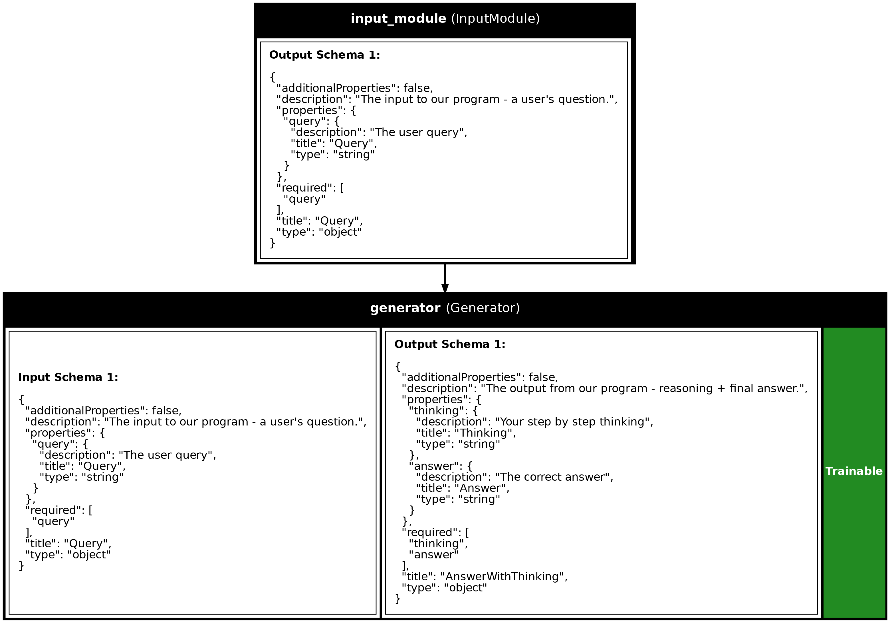

# Quickstart

!!! info
    Want to use Synalinks with your own coding agent (Claude Code, Cursor, Copilot, etc.)? Add the Synalinks-specific skills from [`synalinks-skills`](https://github.com/SynaLinks/synalinks-skills) on GitHub to your agent — they teach it the framework conventions and give it the context it needs to build Synalinks programs right away.

## Install

### Quickstart in 3s with `uv` (recommended)

If you don't know `uv`, install it [here](https://docs.astral.sh/uv/getting-started/installation/).

`synalinks init` scaffolds a ready-to-run project from a template — a script, a
REST API, a full-stack app, an MCP server, or a self-improving training/agent
harness. Start a new Synalinks project in 3 seconds:

```shell
uvx synalinks init
```

See [Project Templates](Project Templates.md) for what each template gives you.

---

You can also add the library to an existing project:

```shell
uv add synalinks
```

## Set up a language model

Every program below sends requests to a language model, so you need one reachable
*before* you run any of the examples.

The examples use a model served locally by [Ollama](https://ollama.com) — it is free
and needs no API key. Install Ollama, then pull the model once:

```shell
ollama pull mistral
```

Ollama serves the model in the background; keep it running while you execute a program.

Prefer a hosted provider? Synalinks integrates Anthropic, Mistral, Groq, OpenAI and more.
Set the matching API key and change the `model` string — the rest of the code stays the
same:

```python
import os

os.environ["ANTHROPIC_API_KEY"] = "your-api-key"

language_model = synalinks.LanguageModel(
    model="anthropic/claude-3-5-sonnet-latest",
)
```

See the [Language Models API](Synalinks API/Language Models API.md) for the full list of
supported providers and model strings.

## Programming your application: 4 ways

### Using the `Functional` API

You start from `Input`, you chain modules calls to specify the program's structure, 
and finally, you create your program from inputs and outputs:

```python
import synalinks
import asyncio

async def main():
    class Query(synalinks.DataModel):
        query: str = synalinks.Field(
            description="The user query",
        )

    class AnswerWithThinking(synalinks.DataModel):
        thinking: str = synalinks.Field(
            description="Your step by step thinking process",
        )
        answer: float = synalinks.Field(
            description="The correct numerical answer",
        )

    language_model = synalinks.LanguageModel(
        model="ollama/mistral",
    )

    x0 = synalinks.Input(data_model=Query)
    x1 = await synalinks.Generator(
        data_model=AnswerWithThinking,
        language_model=language_model,
    )(x0)

    program = synalinks.Program(
        inputs=x0,
        outputs=x1,
        name="chain_of_thought",
        description="Useful to answer in a step by step manner.",
    )

    # Run the program and print the structured result.
    result = await program(
        Query(query="What is 2 + 2? Reason step by step."),
    )
    print(result.prettify_json())

if __name__ == "__main__":
    asyncio.run(main())
```

Running this prints the structured output — both the model's reasoning and the typed
`answer` field:

```json
{
  "thinking": "Two plus two means adding 2 and 2 together, which gives 4.",
  "answer": 4.0
}
```

### Subclassing the `Program` class

In that case, you should define your modules in `__init__()` and implement the program's structure in `call()`.

**Note:** you can optionaly have a `training` argument (boolean), which you can use to specify a different behavior in training and inference.

```python
import synalinks
import asyncio

async def main():
    class Query(synalinks.DataModel):
        query: str = synalinks.Field(
            description="The user query",
        )

    class AnswerWithThinking(synalinks.DataModel):
        thinking: str = synalinks.Field(
            description="Your step by step thinking process",
        )
        answer: float = synalinks.Field(
            description="The correct numerical answer",
        )

    class ChainOfThought(synalinks.Program):
        """Useful to answer in a step by step manner.
        
        The first line of the docstring is provided as description
        for the program if not provided in the `super().__init__()`.
        In a similar way the name is automatically infered based on
        the class name if not provided.
        """

        def __init__(
            self,
            language_model=None,
            name=None,
            description=None,
            trainable=True,
        ):
            super().__init__(
                name=name,
                description=description,
                trainable=trainable,
            )
            # Keep a reference so get_config() below can serialize it.
            self.language_model = language_model
            self.answer = synalinks.Generator(
                data_model=AnswerWithThinking,
                language_model=language_model,
                name="generator_"+self.name,
            )

        async def call(self, inputs, training=False):
            if not inputs:
                return None
            x = await self.answer(inputs, training=training)
            return x

        def get_config(self):
            config = {
                "name": self.name,
                "description": self.description,
                "trainable": self.trainable,
            }
            language_model_config = \
            {
                "language_model": synalinks.saving.serialize_synalinks_object(
                    self.language_model
                )
            }
            return {**config, **language_model_config}

        @classmethod
        def from_config(cls, config):
            language_model = synalinks.saving.deserialize_synalinks_object(
                config.pop("language_model")
            )
            return cls(language_model=language_model, **config)

    language_model = synalinks.LanguageModel(model="ollama/mistral")

    program = ChainOfThought(language_model=language_model)

if __name__ == "__main__":
    asyncio.run(main())
```

### Mixing the subclassing and the `Functional` API

This way of programming is recommended to encapsulate your application while providing an easy to use setup.
It is the recommended way for most users as it avoid making your program/agents from scratch.
In that case, you should implement only the `__init__()` and `build()` methods.

```python
import synalinks
import asyncio

async def main():

    class Query(synalinks.DataModel):
        query: str = synalinks.Field(
            description="The user query",
        )

    class AnswerWithThinking(synalinks.DataModel):
        thinking: str = synalinks.Field(
            description="Your step by step thinking process",
        )
        answer: float = synalinks.Field(
            description="The correct numerical answer",
        )

    class ChainOfThought(synalinks.Program):
        """Useful to answer in a step by step manner."""

        def __init__(
            self,
            language_model=None,
            name=None,
            description=None,
            trainable=True,
        ):
            super().__init__(
                name=name,
                description=description,
                trainable=trainable,
            )

            self.language_model = language_model
        
        async def build(self, inputs):
            outputs = await synalinks.Generator(
                data_model=AnswerWithThinking,
                language_model=self.language_model,
            )(inputs)

            # Create your program using the functional API
            super().__init__(
                inputs=inputs,
                outputs=outputs,
                name=self.name,
                description=self.description,
                trainable=self.trainable,
            )

    language_model = synalinks.LanguageModel(
        model="ollama/mistral",
    )

    program = ChainOfThought(
        language_model=language_model,
    )

if __name__ == "__main__":
    asyncio.run(main())
```

This allows you to not have to implement the `call()` and serialization methods
(`get_config()` and `from_config()`). The program will be built for any inputs the first time called.

### Using the `Sequential` API

In addition, `Sequential` is a special case of program where the program
is purely a stack of single-input, single-output modules.

```python
import synalinks
import asyncio

async def main():
    class Query(synalinks.DataModel):
        query: str = synalinks.Field(
            description="The user query",
        )

    class AnswerWithThinking(synalinks.DataModel):
        thinking: str = synalinks.Field(
            description="Your step by step thinking process",
        )
        answer: float = synalinks.Field(
            description="The correct numerical answer",
        )

    language_model = synalinks.LanguageModel(
        model="ollama/mistral",
    )

    program = synalinks.Sequential(
        [
            synalinks.Input(
                data_model=Query,
            ),
            synalinks.Generator(
                data_model=AnswerWithThinking,
                language_model=language_model,
            ),
        ],
        name="chain_of_thought",
        description="Useful to answer in a step by step manner.",
    )

if __name__ == "__main__":
    asyncio.run(main())
```

## Getting a summary of your program

To print a tabular summary of your program:

```python
program.summary()
```

Or a plot (Useful to document your system):

```python
synalinks.utils.plot_program(
    program,
    show_module_names=True,
    show_trainable=True,
    show_schemas=True,
)
```



## Running your program

To run your program use the following:

```python
result = await program(
    Query(query="What is the French city of aerospace?"),
)
```

`await` only works inside an `async` function (or a notebook cell). In a script, call it
from your `async def main()` and launch it with `asyncio.run(main())`, exactly like the
Functional API example above.

## Training your program

```python
async def main():

    # ... your program definition

    (x_train, y_train), (x_test, y_test) = synalinks.datasets.gsm8k.load_data()

    program.compile(
        reward=synalinks.rewards.ExactMatch(in_mask=["answer"]),
        optimizer=synalinks.optimizers.RandomFewShot()
    )

    batch_size=32
    epochs=10

    history = await program.fit(
        x_train,
        y_train,
        validation_data=(x_test, y_test),
        batch_size=batch_size,
        epochs=epochs,
    )

    synalinks.utils.plot_history(history)

if __name__ == "__main__":
    asyncio.run(main())
```