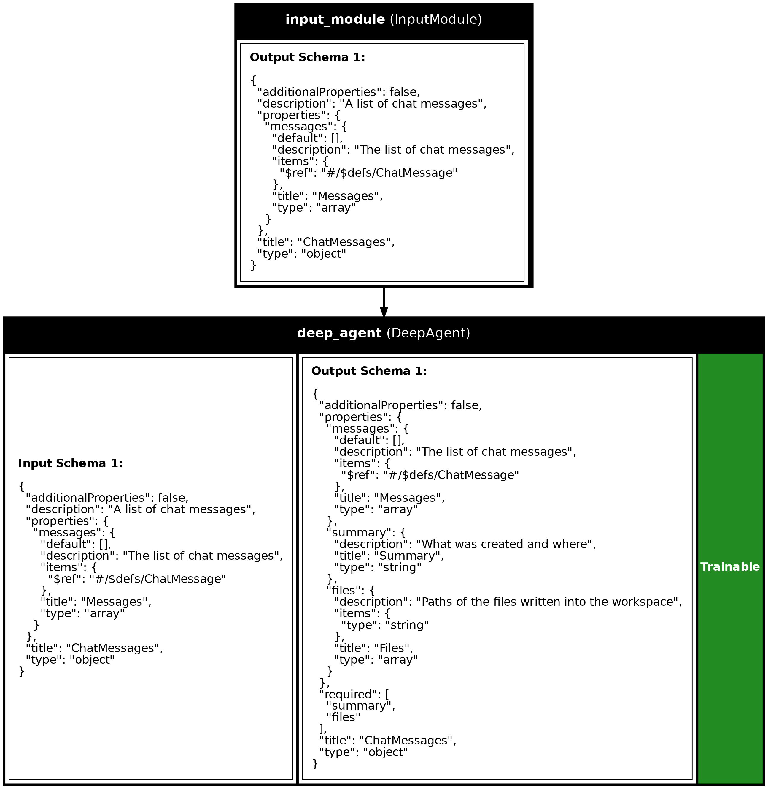

<div align="center">
<picture>
  <source media="(prefers-color-scheme: dark)" srcset="../img/synalinks-dark.svg">
  
</picture>
</div>

<div align="center">

<b>От идеи до продакшена всего за несколько строк</b>

<em>Первый нейросимвольный фреймворк для языковых моделей (LM), сочетающий простоту Keras и строгость лучших практик глубокого обучения.</em>

<b>Создавайте [RAG-системы](https://synalinks.github.io/synalinks/guides/Knowledge%20Base/), [агентов с инструментами](https://synalinks.github.io/synalinks/guides/Agents/), мультиагентные системы, [рекурсивных агентов](https://synalinks.github.io/synalinks/guides/Recursive%20Language%20Model%20Agent/) и многое другое всего за несколько строк</b>

[Deutsch](README_de.md) | 
[English](../README.md) | 
[Español](README_es.md) | 
[Français](README_fr.md) | 
[Italiano](README_it.md) | 
[日本語](README_ja.md) | 
[한국어](README_ko.md) | 
[Português](README_pt.md) | 
[Русский](README_ru.md) | 
[中文](README_zh.md)

<p align="center">
  <a href="https://synalinks.github.io/synalinks" target="_blank"><strong>Документация</strong></a> ·
  <a href="https://synalinks.github.io/synalinks/FAQ/" target="_blank"><strong>FAQ</strong></a> ·
  <a href="https://discord.gg/82nt97uXcM" target="_blank"><strong>Discord</strong></a> ·
  <a href="https://github.com/SynaLinks/synalinks/tree/main/examples" target="_blank"><strong>Примеры кода</strong></a> .
  <a href="https://github.com/SynaLinks/synalinks/tree/main/guides" target="_blank"><strong>Руководства</strong></a>
</p>

</div>

<div align="center">

Если Synalinks оказался вам полезен, поставьте репозиторию звезду! Помогите нам привлечь больше AI/ML-инженеров и развить сообщество.


[](https://github.com/psf/black)

[](https://pepy.tech/project/synalinks)
[](https://discord.gg/82nt97uXcM)
[](https://github.com/SynaLinks/SynaLinks/actions/workflows/tests.yml)
[](https://opensource.org/license/apache-2-0)
[](https://deepwiki.com/SynaLinks/synalinks)

</div>

<div align="center">

Хотите использовать Synalinks со своим кодинг-агентом (Claude Code, Cursor, Copilot и т. д.)? Добавьте специализированные навыки Synalinks из репозитория [`synalinks-skills`](https://github.com/SynaLinks/synalinks-skills) на GitHub в свой агент: они обучат его соглашениям фреймворка и дадут контекст, необходимый для того, чтобы сразу писать программы на Synalinks.

</div>

## Что такое Synalinks?

Synalinks представляет собой нейросимвольный фреймворк с открытым исходным кодом, который упрощает создание, обучение, оценку и развёртывание продвинутых приложений на базе языковых моделей, включая RAG-системы, автономных агентов и самоэволюционирующие системы рассуждений.

Представьте себе Keras для приложений на языковых моделях. Это чистый, декларативный API, в котором:

- Вы **компонуете** [модули `Module`](https://synalinks.github.io/synalinks/guides/Modules/) так же, как слои `Layer` в глубоком обучении.
- Вы **[обучаете и оптимизируете](https://synalinks.github.io/synalinks/guides/Training/)** с помощью обучения с подкреплением в контексте (in-context RL).
- Вы **развёртываете** в виде [REST API](https://synalinks.github.io/synalinks/guides/FastAPI%20Deployment/) или [MCP-серверов](https://synalinks.github.io/synalinks/guides/FastMCP%20Deployment/).

### Ключевые принципы

- **Постепенное усложнение**: [начните с простого и естественно переходите к продвинутому](https://synalinks.github.io/synalinks/guides/Getting%20Started/).
- **Нейросимвольное обучение**: сочетайте [логику, структуру](https://synalinks.github.io/synalinks/guides/Data%20Models/) и [языковые модели](https://synalinks.github.io/synalinks/guides/Getting%20Started/).
- **Оптимизация в контексте**: [улучшайте рассуждения модели без переобучения весов](https://synalinks.github.io/synalinks/guides/Trainable%20Variables/).

## Для кого этот фреймворк?

<div align="center">

| Роль                      | Чем поможет Synalinks                                       |
| ------------------------- | ----------------------------------------------------------- |
| **AI-разработчики**      | Создавайте сложные LM-приложения промышленного уровня без шаблонного кода. |
| **AI-исследователи**     | Быстро прототипируйте нейросимвольные системы и системы с in-context RL. |
| **Дата-сайентисты**    | Интегрируйте LM-пайплайны с API и базами данных.               |
| **Студенты и энтузиасты** | Изучайте композицию AI-систем в чистом и интуитивном фреймворке. |

</div>

## Почему Synalinks?

Сегодня существует множество фреймворков; вот что Synalinks делает иначе:

- **Встроенная песочница без контейнеров**: агенты выполняют недоверенный код и инструменты в [безопасной изолированной среде](https://synalinks.github.io/synalinks/guides/Agents/), которой **не нужен Docker или внешний сервис песочницы**. Весь стек написан на чистом Python и встраивается куда угодно, поэтому отлично подходит для скриптов, исследований, serverless/облачных развёртываний (S3, Lambda, ноутбуки и т. д.) и даже для создания CLI-инструментов!
- **Поддержка встраиваемых баз данных**: создавайте [графовые RAG-системы и агентную память](https://synalinks.github.io/synalinks/guides/Knowledge%20Base/) с **ограниченным (constrained) извлечением графов знаний** и **автоматической семантической дедупликацией** поверх встраиваемой графовой базы данных, без отдельного графового сервера. Кроме того, доступна быстрая встраиваемая **SQL-база знаний** для хранения реляционных данных и построения векторных/SQL RAG-систем.
- **In-context RL для оптимизации промптов (и не только)**: [обучайте и оптимизируйте](https://synalinks.github.io/synalinks/guides/Training/) промпты, few-shot примеры и [любые обучаемые переменные](https://synalinks.github.io/synalinks/guides/Trainable%20Variables/) для каждого модуля **не трогая веса модели**, с помощью привычного API `.compile()` / `.fit()` / `.evaluate()` / `.predict()`.
- **Лёгкое переключение между моделями**: задайте модель по умолчанию один раз через `synalinks.set_default_language_model(...)` или передайте строковый идентификатор, после чего переключайтесь между Ollama, vLLM, OpenAI, Azure, Anthropic, Mistral, Groq, Gemini, xAI, Cohere, DeepSeek, Together AI, OpenRouter, AWS Bedrock и Doubleword через [LiteLLM](https://docs.litellm.ai/docs/), включая [многокритериальный выбор модели](https://synalinks.github.io/synalinks/guides/Multi-Objective%20LM%20Selection/) для оптимального соотношения цены и качества.
- **Скаффолдинг одной командой, а кодинг-агент выбираете вы**: разверните готовый к продакшену проект командой `synalinks init` (шаблоны «всё включено» для скриптов, агентов и обучения), а затем подключите официальные [навыки Synalinks](https://github.com/SynaLinks/synalinks-skills), чтобы Claude Code, Cursor, Copilot и другие с самого начала писали идиоматичный код на Synalinks.

Плюс всё, что вы ожидаете от фреймворка промышленного уровня:

- **НОВОЕ**: теперь все агенты поддерживают [Agent Skills](https://agentskills.io/home), `AGENTS.md` и суб-агентов.
- **[Гарантированно структурированные выходные данные](https://synalinks.github.io/synalinks/guides/Data%20Models/)** (JSON) для корректности
- **API сообщений, совместимый с Chat Completions**: сообщения точь-в-точь повторяют формат OpenAI Chat Completions по каждому ключу + расширены litellm-полями `reasoning_content` и `thinking_blocks`, чтобы рассуждения провайдера сохранялись в многоходовых диалогах. Также поддерживаются **[мультимодальные входные данные](https://synalinks.github.io/synalinks/guides/Multimodal%20Inputs/)** (изображения и аудио как стандартные части контента)
- **Версионируемые**, JSON-сериализуемые [пайплайны](https://synalinks.github.io/synalinks/guides/Programs/)
- **Автоматическое [асинхронное и параллельное выполнение](https://synalinks.github.io/synalinks/guides/Programs/)** по умолчанию
- **Встроенные [метрики](https://synalinks.github.io/synalinks/guides/Metrics/), [награды](https://synalinks.github.io/synalinks/guides/Rewards/) и [датасеты](https://synalinks.github.io/synalinks/guides/Datasets/)**
- **Готовность к API**: развёртывание с [FastAPI](https://synalinks.github.io/synalinks/guides/FastAPI%20Deployment/) или [FastMCP](https://synalinks.github.io/synalinks/guides/FastMCP%20Deployment/)
- **[Совместимость с KerasTuner](https://synalinks.github.io/synalinks/guides/Hyperparameter%20Search/)** для поиска гиперпараметров
- **Встроенные [колбэки](https://synalinks.github.io/synalinks/guides/Callbacks/) и хуки** для [наблюдаемости](https://synalinks.github.io/synalinks/guides/Observability/) (включая колбэк `Monitor` для MLflow)

# Требования

- Python 3.12 или новее
- WSL2 для пользователей Windows

## Быстрый старт за 3 секунды с `uv` (рекомендуется)

Если вы не знакомы с `uv`, установите его [отсюда](https://docs.astral.sh/uv/getting-started/installation/).

Следуйте инструкциям, чтобы создать новый проект Synalinks за 3 секунды:

```shell
uvx synalinks init
```

---

Вы также можете установить библиотеку в новый проект командой:

```shell
uv add synalinks
```

Чтобы превратить свой кодинг-агент в AI-инженера, выполните в корне проекта:

```shell
npx skills add SynaLinks/synalinks-skills --skill synalinks
```

## Пример

Агенты Synalinks теперь могут читать соглашения вашего проекта из [`AGENTS.md`](https://agents.md)
и использовать [Agent Skills](https://agentskills.io/home). Пример ниже
подключает официальные [навыки Synalinks](https://github.com/SynaLinks/synalinks-skills)
к [`DeepAgent`](https://synalinks.github.io/synalinks/guides/Agents/),
кодинг-агенту в песочнице, и просит его спроектировать входные и выходные модели данных для
задачи, записав их в папку `workspace/`.

Сначала подготовьте рабочую область. Установите официальный навык Synalinks с помощью
CLI [`skills`](https://skills.sh) и добавьте `AGENTS.md`. Навык устанавливается внутрь
рабочего каталога, поэтому агент в песочнице может читать его содержимое по запросу:

```shell
mkdir -p workspace && cd workspace
# Устанавливает навык `synalinks` в ./.agents/skills/ и записывает skills-lock.json.
npx skills add SynaLinks/synalinks-skills --skill synalinks
```

Получается следующая структура, где `.agents/skills` является *корнем* навыков (по одной
подпапке на навык, в каждой лежит `SKILL.md`):

```text
workspace/
├── AGENTS.md                     # внедряется как соглашения для агента
├── skills-lock.json              # фиксирует навык на исходный репозиторий + хеш содержимого
└── .agents/
    └── skills/                   # корень навыков
        └── synalinks/
            └── SKILL.md          # имя + описание показываются сразу; тело читается по запросу
```

`main.py`:

```python
import synalinks
import asyncio

# Задайте модель по умолчанию один раз; модули подхватят её автоматически.
synalinks.set_default_language_model("gemini/gemini-3.1-flash-lite-preview")


# Структурированный итоговый ответ агента.
class Deliverable(synalinks.DataModel):
    summary: str = synalinks.Field(
        description="What was created and where",
    )
    files: list[str] = synalinks.Field(
        description="Paths of the files written into the workspace",
    )


async def main():
    # DeepAgent общается через ChatMessages (это кодинг-агент).
    inputs = synalinks.Input(data_model=synalinks.ChatMessages)

    agent = synalinks.DeepAgent(
        data_model=Deliverable,
        # Песочница инициализируется из этого каталога (безопасно для хоста:
        # записи агента попадают в копию внутри песочницы и никогда не оказываются на вашем диске).
        # Его `AGENTS.md` внедряется, чтобы агент следовал вашим соглашениям.
        workdir="workspace",
        # Корень навыков (установленный через `skills add`). Показывается агенту как
        # `<available_skills>`; каждый `SKILL.md` он читает по запросу из
        # песочницы; именно поэтому навыки лежат внутри `workdir`.
        skills=["workspace/.agents/skills"],
    )
    outputs = await agent(inputs)

    program = synalinks.Program(
        inputs=inputs,
        outputs=outputs,
        name="datamodel_designer",
        description="Designs Synalinks data models for a given task",
    )

    task = (
        "Define the input and output Synalinks DataModels for a support-ticket "
        "triage task: the input is a raw customer message; the output is the "
        "predicted category, a priority, and a short suggested reply. Write them "
        "to `models.py` using idiomatic Synalinks; consult the skills first."
    )
    result = await program(
        synalinks.ChatMessages(
            messages=[synalinks.ChatMessage(role="user", content=task)],
        )
    )
    print(result.prettify_json())


if __name__ == "__main__":
    asyncio.run(main())
```

## Операторы моделей данных

Synalinks предоставляет Python-операторы для комбинирования и преобразования моделей данных, позволяя строить сложные потоки управления. Смотрите [руководство по потокам управления](https://synalinks.github.io/synalinks/guides/Control%20Flow/), чтобы узнать о паттернах маршрутизации, разветвления и слияния, которые обеспечивают эти операторы:

<div align="center">

| Оператор | Название | Описание | Сценарий использования |
| :---: | --- | --- | --- |
| `+` | Конкатенация | Объединяет поля обеих моделей данных. Выбрасывает исключение, если одна из них `None`. | Слияние выходов параллельных ветвей |
| `&` | Логическое И | Безопасная конкатенация, возвращающая `None`, если один из входов равен `None`. | Комбинирование с потенциально пустыми выходами ветвей |
| `\|` | Логическое ИЛИ | Возвращает модель данных, отличную от `None`. Если обе не `None`, объединяет их. | Сбор выходов условных ветвей |
| `^` | Логическое исключающее ИЛИ | Возвращает данные, если ровно один вход не `None`, иначе `None`. | Выбор ровно одной ветви |
| `~` | Логическое НЕ | Возвращает `None`, если вход не `None`, или пустую модель данных, если вход `None`. | Инвертирование условий ветвления |
| `in` | Вхождение | Проверяет, есть ли строковый ключ среди свойств схемы или содержится ли схема другой модели данных. Возвращает `True` или `False`. | Условная проверка полей, валидация схем |

</div>

```python
# Параллельные ветви с конкатенацией
x1 = await generator1(inputs)
x2 = await generator2(inputs)
# combined = x1 *и* x2
combined = x1 & x2  # Объединить оба выхода (при коллизии ключей добавляется суффикс _{i})
# [...]
# Условные ветви с логическим ИЛИ
(easy, hard) = await synalinks.Branch(
    question="Is this query complex?",
    labels=["easy", "hard"],
    branches=[simple_generator, complex_generator],
)(inputs)
# result = easy *или* hard
result = easy | hard  # Получить ту ветвь, которая была выбрана
```

## Сводка по вашей программе

Чтобы вывести табличную сводку по программе:

```python
program.summary()
```

Или построить диаграмму (полезно для документирования системы):

```python
synalinks.utils.plot_program(
    program,
    show_module_names=True,
    show_trainable=True,
    show_schemas=True,
)
```

<div align="center">


<em>Программа проектирования моделей данных, визуализированная с помощью plot_program: Input → DeepAgent. Обучаемые модули отмечены зелёным.</em>
</div>

## Запуск программы

Для запуска программы используйте следующее:

```python
result = await program(
    Query(
        query=(
            "A bookstore receives a shipment of 135 new books."
            "They place the books evenly onto 9 shelves."
            "Later, they decide to move 3 books from each shelf to a display table"
            " at the front of the store. "
            "How many books are left on the shelves after the books are moved?"
        )
    ),
)
```

## Обучение программы/агента

```python
# Задание языковой модели и модели эмбеддингов по умолчанию позволяет
# использовать строковый идентификатор (как в Keras) для настройки пайплайна/обучения.
# Вы по-прежнему можете инстанцировать классы, если нужен тонкий контроль.
synalinks.set_default_language_model("gemini/gemini-3.1-flash-lite-preview")
synalinks.set_default_embedding_model("gemini/text-embedding-004")


async def main():

    # ... определение вашей программы

    (x_train, y_train), (x_test, y_test) = synalinks.datasets.gsm8k.load_data()

    program.compile(
        reward=synalinks.rewards.ExactMatch(in_mask=["answer"]),
        optimizer="omega",
    )

    batch_size = 1
    epochs = 10

    history = await program.fit(
        x_train,
        y_train,
        validation_split=0.2,
        batch_size=batch_size,
        epochs=epochs,
    )


if __name__ == "__main__":
    asyncio.run(main())
```

## Сохранение и загрузка

Чтобы сохранить всю архитектуру и переменные (состояние программы) в JSON-файл, выполните:

```python
program.save("my_program.json")
```

Чтобы загрузить её, выполните:

```python
loaded_program = synalinks.Program.load("my_program.json")
```

Чтобы сохранить только состояние программы (переменные) в JSON:

```python
program.save_variables("my_program.variables.json")
```

Чтобы загрузить её переменные (требуется программа с той же архитектурой), выполните:

```python
program.load_variables("my_program.variables.json")
```

## Логирование

Чтобы включить логирование, добавьте в начало скрипта:

```python
synalinks.enable_logging()
```

## Наблюдаемость

Synalinks предоставляет встроенную наблюдаемость через MLflow для трассировки и мониторинга ваших программ.

> **Важно**: вызывайте `enable_observability()` **до** создания любых модулей.

```python
import synalinks

# Сначала включаем наблюдаемость
synalinks.enable_observability(
    tracking_uri="http://localhost:5000",  # Необязательно: URI сервера MLflow
    experiment_name="my_experiment",  # Необязательно: по умолчанию "synalinks_traces"
)

# Затем создаём модули; они будут трассироваться автоматически
inputs = synalinks.Input(data_model=Query)
outputs = await synalinks.Generator(...)(inputs)
```

Для метрик обучения и артефактов используйте колбэк `Monitor`:

```python
monitor = synalinks.callbacks.Monitor(
    tracking_uri="http://localhost:5000",
    experiment_name="training_runs",
)

await program.fit(x=train_x, y=train_y, callbacks=[monitor])
```

Для расширенной настройки смотрите [руководство по наблюдаемости](https://synalinks.github.io/synalinks/guides/Observability/).

### Узнать больше

Вы можете узнать больше, прочитав нашу [документацию](https://synalinks.github.io/synalinks/). Если у вас есть вопросы, возможно, вам поможет [FAQ](https://synalinks.github.io/synalinks/FAQ/).

### Вклад в проект

Мы приветствуем вклад в проект, будь то реализация дополнительных модулей, метрик или оптимизаторов.
За дополнительной информацией или помощью в реализации ваших идей (или идей из научных статей) присоединяйтесь к нашему Discord.

Обратите внимание, что каждая дополнительная метрика/модуль/оптимизатор должны быть одобрены основной командой: мы хотим сохранить библиотеку максимально минимальной и чистой, чтобы избежать неконтролируемого роста, ведущего к плохим практикам разработки, как в большинстве ведущих LM-фреймворков.

Если у вас есть конкретные отзывы или запросы на новые возможности, мы приглашаем вас открыть [issue](https://github.com/SynaLinks/synalinks/issues).

### Участники

Именно ваш вклад, отзывы и поддержка позволяют проекту развиваться.

Каким бы ни был ваш вклад, от небольших исправлений багов до крупных фич, спасибо, что верите в открытое сотрудничество и будущее нейросимвольного ИИ.

<a href="https://github.com/SynaLinks/synalinks/graphs/contributors">
  
</a>

### Сообщество

Присоединяйтесь к нашему сообществу, чтобы узнать больше о нейросимвольных системах и будущем ИИ. Мы рады участию людей с самым разным опытом и уровнем подготовки.

### Цитирование нашей работы

Эта работа была выполнена под руководством Франсуа Шолле, автора Keras. Если эта работа полезна для ваших исследований, пожалуйста, используйте следующую запись bibtex:

```bibtex
@misc{sallami2025synalinks,
  title={Synalinks},
  author={Sallami, Yoan and Chollet, Fran\c{c}ois},
  year={2025},
  howpublished={\url{https://github.com/SynaLinks/Synalinks}},
}
```

### Благодарности

Synalinks не существовал бы без замечательной работы следующих open-source проектов:

- [Keras](https://keras.io/): основа вычислений на графах, API, а также код, дизайн и философия в целом.
- [DSPy](https://dspy.ai/): вдохновение для модулей/оптимизаторов.
- [Pydantic](https://docs.pydantic.dev/latest/): слой данных бэкенда.
- [LiteLLM](https://docs.litellm.ai/docs/): интеграции с языковыми моделями.
- [DuckDB](https://duckdb.org/), [Ladybug](https://ladybugdb.com/), [LanceDB](https://www.lancedb.com/): потрясающие встраиваемые базы данных.
- [MirageAI](https://www.strukto.ai/mirage): потрясающая песочница!
